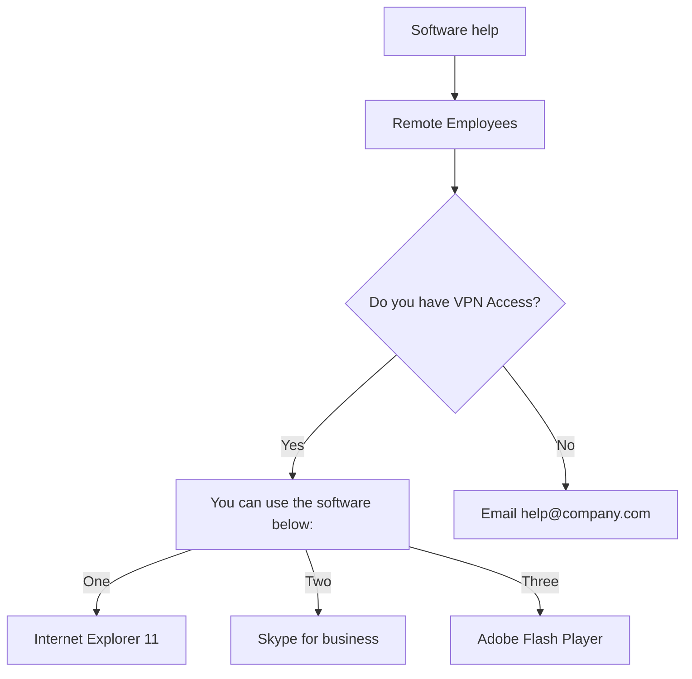
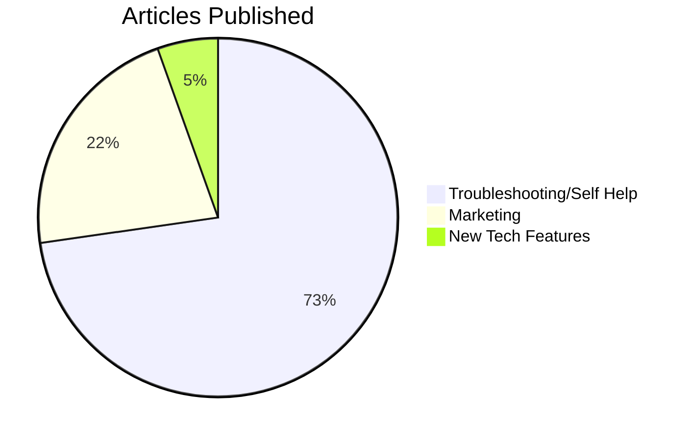

Flowchart of our Software help process: 
 
 

```mermaid
flowchart TD
A[Software help]--> B[Remote Employees]
B--> C{Do you have VPN Access?}
C --Yes -->D[You can use the software below:]
D -->|One| E[Internet Explorer 11]
D -->|Two| F[Skype for business]
D -->|Three| G[Adobe Flash Player]
C --No -->H[Email help@company.com]
```

Pie Chart with percentages of recent publication types:

```mermaid
pie title Articles Published
    "Troubleshooting/Self Help" : 200
    "Marketing" : 60
    "New Tech Features" : 15
```
