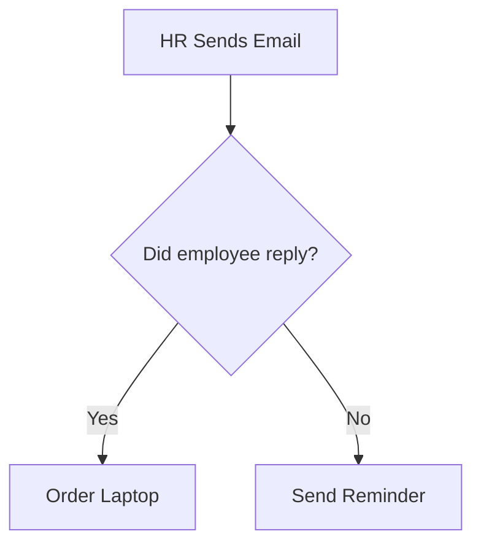

Here is the visual breakdown of our new hire onboarding process:
 

```mermaid
graph TD;
    A[HR Sends Email] --> B{Did employee reply?};
    B -- Yes --> C[Order Laptop];
    B -- No --> D[Send Reminder];
```
